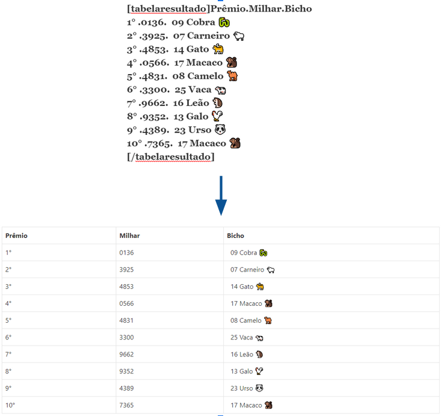
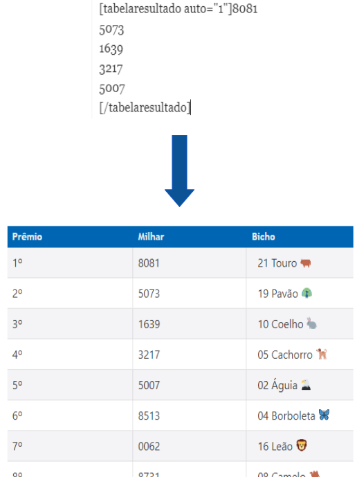
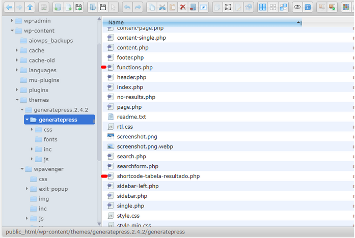
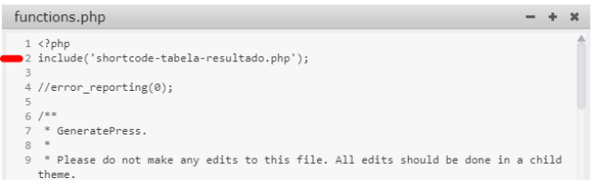

# Instalação da Tag

A tag é composta por apenas um arquivo, chamado *shortcode-tabela-resultado.php*. Esse arquivo contém a lógica da tag "[tabelaresultado]", cujo propósito é gerar uma tabela formatada à partir de um texto pré-existente ou gerar um conteúdo automático com base em algumas informações:



_Exemplo de Formatação_




_Exemplo de Geração Automática_

Para realizar a instalação, você precisa fazer o upload do arquivo citado acima para a pasta onde está instalado o seu tema, no mesmo nível que o arquivo *functions.php*, conforme imagem abaixo.



Em seguida, edite o arquivo functions.php para adicionar a linha abaixo, conforme ilustra a imagem.

```php
include('shortcode-tabela-resultado.php');
```



Pronto, a tag está apta a ser utilizada em seus posts, bastando abrí-la com `[tabelaresultado]` e fechá-la com `[/tabelaresultado]`.