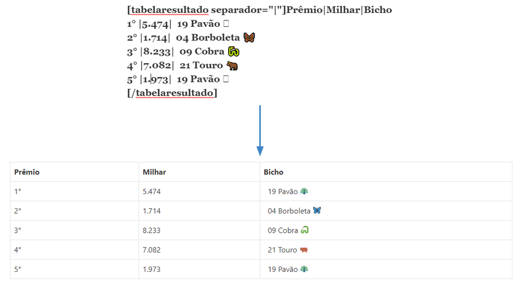

## Mudando Separador

Caso não queira mais utilizar o “.” como separador, por exemplo caso tenha esse caractere em seu texto, e queira utilizar outro caractere, basta utilizar o atributo “separador” conforme exemplo a seguir:

