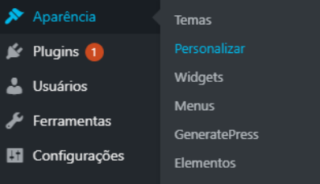
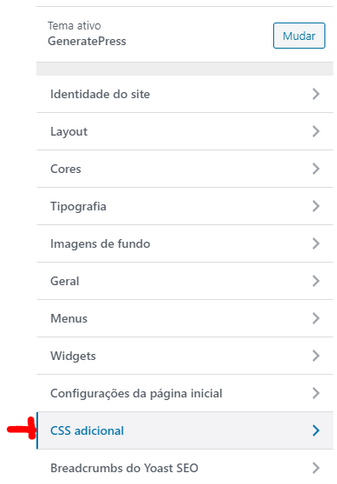
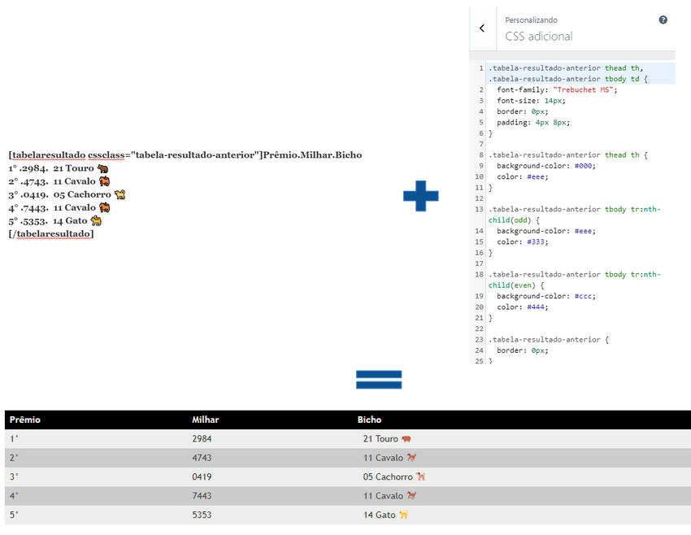

## Mudando Estilo

A tag foi desenvolvida para que a tabela resultante tenha estilo 100% customizável através do CSS. Ou seja, é possível mudar cor da fonte, cor do fundo, tipo da fonte, tamanho do texto, espaçamento, borda, deixar a tabela com estilo “zebrado”, dentre outros. Para poder alterar o estilo, faça o seguinte:

1. Na área administrativa de seu site, acesse “Aparência > Personalizar”

2. Escolha a opção “CSS adicional”

3. Na janela, adicione/altere o CSS correspondente à tabela. Após concluir, clique em “Publicar”.

Através da tag “cssclass” você pode criar um estilo novo completamente apartado do estilo das demais tabelas. Veja esse exemplo abaixo:

