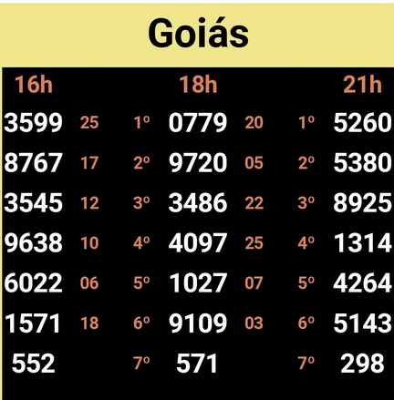

### Bilhetes com 7 prêmios

O sexto prêmio é derivado da soma dos cinco primeiros prêmios, considerando os últimos 4 dígitos para compor o seu milhar. Já o sétimo prêmio é derivado da multiplicação entre o primeiro e segundo prêmios, extraindo os três dígitos "centrais"; adiciona-se "0" à esquerda até completar 6 dígitos caso o resultado do produto entre os dois primeiros prêmios resulte em um número inferior a 100000. Para fixação, considere o bilhete das 16h abaixo:

**Constituição do 6º Prêmio**
- 1º Prêmio + 2º Prêmio + 3º Prêmio + - 4º Prêmio + 5º Prêmio
- 3599 + 8767 + 3545 + 9638 + 6022
- 3599 + 8767 + 3545 + 9638 + 6022
- 3**1571**
- 1571 (primeiros 4 dígitos, da direita para esquerda)

**Constituição de 7º Prêmio**
- 1º Prêmio x 2º Prêmio
- 3599 x 8767
- 31.**552**.433
- 552 (da direita para esquerda, os três primeiros dígitos depois do primeiro "." separador)

**Exemplo 6º prêmio quando resultado da soma seja inferior a 1000**

- 0340 + 0070 + 0013 + 0011 + 0050
- 484
- **0**484 (adicionando "0" à esquerda)