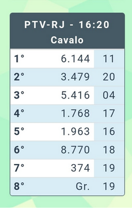

### Bilhetes com 8 prêmios

O cálculo dos sexto e sétimo prêmios é literalmente idêntico ao do Bilhete de 07 prêmios. Para se chegar ao oitavo prêmio, chamado popularmente de “Salteado”, é necessário calcular a dezena do primeiro prêmio por 4 e extrair a dezena desse resultado. Para melhor entendimento, segue bilhete abaixo de exemplo:

**8º Prêmio => Dezena do 1º Prêmio x 4**
- 61**44** x 4
- 44 x 4
- 176
- 19 (pois 76, de acordo com a tabela de Bichos x Grupos, corresponde ao grupo 19)