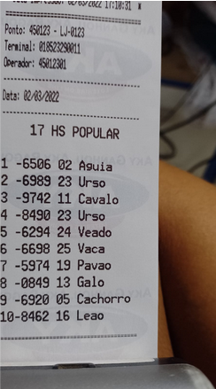

### Bilhete com 10 Prêmios

Do sexto ao nono prêmio, o milhar é derivado do primeiro ao quarto prêmio, e o décimo (último) é derivado dos nove anteriores, que é o algoritmo por trás desse mecanismo exemplificado anteriormente. Para melhor entendimento, considere o bilhete abaixo:

Com base apenas nos quatro primeiros prêmios, descobrimos o milhar do sexto ao nono da seguinte forma:

**1º Passo =>** Separamos cada dígito dos milhares, conforme tabela abaixo, onde a primeira coluna é o primeiro dígito do milhar, segunda coluna é o segundo dígito e assim por diante

| Prêmio | Milhar | 1ª Coluna | 2ª Coluna | 3ª Coluna | 4ª Coluna |
| ------ | ------ | --------- | --------- | --------- | --------- |
| 1º | 6506 | 6 | 5 | 0 | 6 |
| 2º | 6989 | 6 | 9 | 8 | 9 |
| 3º | 9742 | 9 | 7 | 4 | 2 |
| 4º | 8490 | 8 | 4 | 9 | 0 |

**2º Passo =>** Na sequência, lendo de cima para baixo, cada coluna vira o milhar de cada prêmio, ou seja, a primeira coluna (do exemplo, 6698) vira o milhar do sexto prêmio, a segunda coluna vira do sétimo prêmio e assim por diante

| Prêmio | Milhar | 1ª Coluna | 2ª Coluna | 3ª Coluna | 4ª Coluna |
| ------ | ------ | --------- | --------- | --------- | --------- |
| 1º | 6506 | 6 | 5 | 0 | 6 |
| 2º | 6989 | 6 | 9 | 8 | 9 |
| 3º | 9742 | 9 | 7 | 4 | 2 |
| 4º | 8490 | 8 | 4 | 9 | 0 |
| | | **6698** | **5974** | **0849** | **6920** |
| | | **6º Prêmio** | **7º Prêmio** | **8º Prêmio** | **9º Prêmio** |

**3º Passo =>** Para descobrir o último prêmio, basta somar todos os milhares e considerar apenas os quatro últimos dígitos. Tomando o bilhete acima como exemplo, segue:

| Prêmio | Milhar | Soma Acumulada |
| ------ | ------ | -------------- |
| 1º | 6506 | 6506 |
| 2º | 6989 | 13495 |
| 3º | 9742 | 23237 |
| 4º | 8490 | 31727 |
| 5º | 6294 | 38021 |
| 6º | 6698 | 44719 |
| 7º | 5974 | 50693 |
| 8º | 0849 | 51542 |
| 9º | 6920 | 5**8462** |

A soma de tudo deu 58462. Considerando apenas os últimos quatro dígitos, chegamos no 8462