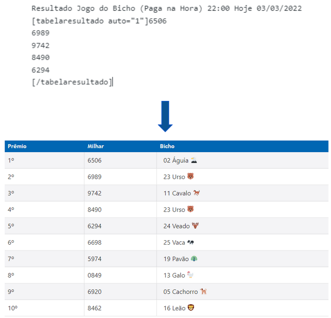

## Tag Automática

A última atualização da tag trouxe o acréscimo de um novo comportamento, que é o de gerar automaticamente o conteúdo novo com base nos cinco primeiros prêmios, conforme exemplo abaixo:

Conforme exemplo acima, é necessário usar o atributo auto=1 e informar apenas os cinco primeiros prêmios.

De acordo com algumas estações/bancas, os prêmios seguintes são derivados dos cinco primeiros. À seguir, explicação de algumas possibilidades. Antes, apenas para referência, o bicho é definido de acordo com seu grupo, que corresponde aos dois últimos dígitos do prêmio.

Por fim, para saber qual bicho deu de acordo com o milhar, basta considerarmos os dois últimos dígitos do milhar e comparar com a tabela abaixo:

Por exemplo, o prêmio que contenha o milhar 6698 terá como bicho a Vaca, pois o final 98 corresponde ao grupo 25.

- [Bilhete com 7 Prêmios](./3.3.1.Bilhete7.md)
- [Bilhete com 8 Prêmios](./3.3.2.Bilhete8.md)
- [Bilhete com 10 Prêmios](./3.3.3.Bilhete10.md)